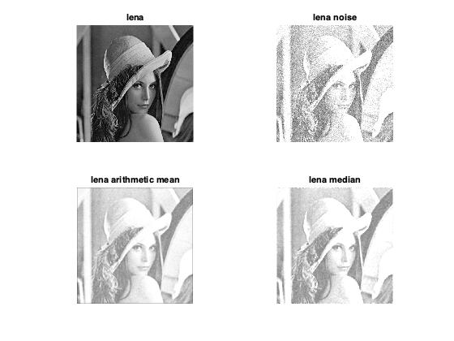
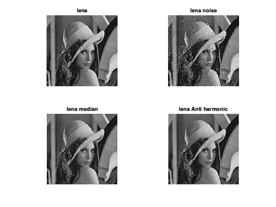
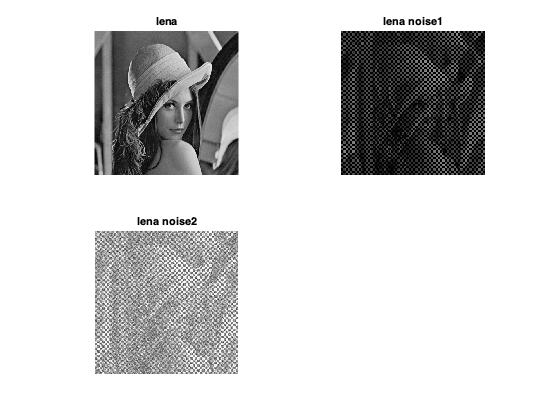
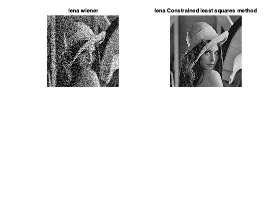

# 数字图像处理第六次作业
### 自动化63
### 杨卓
### 2160504078
---- 

**一.在测试图像上产生高斯噪声lena图-需能指定均值和方差；并用多种滤波器恢复图像，分析各自优缺点；**
### 1.实验原理
高斯噪声指它的概率密度函数服从高斯分布的一类噪声。高斯噪声的灰度值多集中在均值附近。本次实验通过均值滤波器和中值滤波器进行图像滤波。  
算术均值滤波即在sxy表示的中心点（x，y）处计算图像g(x,y)的平均值，此滤波器虽然模糊了图像但降低了噪声。  
中值滤波器即基于有滤波器包围的图像区域中的像素值排序，并选取使用一个像素邻域中灰度值的中值来代替该像素值。
### 2.实验结果  

### 3.结果总结
均值滤波器和中值滤波器在一定程度上都可以降低噪声但同时也模糊了图像。
### 4.代码
	A = inputdlg('Mean ');
	B = str2num(cell2mat(A));
	C = inputdlg('Variance');
	D = str2num(cell2mat(C));
	i1=imread('lena.bmp');
	i2=imnoise(i1,'gaussian',B,D);
	figure(1)
	subplot(221),imshow (i2),title('lena noise');
	imwrite(i2,'lena_noise.bmp');
	____
	i0=imread('lena.bmp');
	i1=imread('lena_noise.bmp');
	n=5;
	h=1/n^2.*ones(n,n);
	i2=conv2(i1,h,'same');
	i2=uint8(i2);
	a=ones(n,n);
	p=size(i1);
	x1=double(i1);
	x2=x1;
	for i=1:p(1)-n+1
	    for j=1:p(2)-n+1
	        c=x1(i:i+(n-1),j:j+(n-1));
	        e=c(1,:);
	        for u=2:n
	            e=[e,c(u,:)];
	        end
	        gg=median(e);
	        x2(i+(n-1)/2,j+(n-1)/2)=gg;
	    end
	end
	i3=uint8(x2);
	figure(1);
	subplot(221),imshow (i0),title('lena');
	subplot(222),imshow (i1),title('lena noise');
	subplot(223),imshow (i2),title('lena arithmetic mean');
	subplot(224),imshow (i3),title('lena median');
	  
**二.在测试图像lena图加入椒盐噪声（椒和盐噪声密度均是0.1）；用学过的滤波器恢复图像；在使用反谐波分析Q大于0和小于0的作用；**
### 1.实验原理
椒盐噪声是指图像中的一些分散的黑点和白点这个时候就可以用中值滤波器进行滤波，当取中值时，该区域中的全为1或0的点都会被去除。
### 2.实验结果  

### 3.结果总结
对比可以看出，中值滤波器对于椒盐噪声的处理毫无疑问是最好的，同时它引起的模糊也不大，对于椒盐噪声此类冲激噪声去除效果特别好。对于椒盐噪声同时存在时频域的低通或者高通滤波器效果都不太好，原因是这两个极端无法同时被消去。  
反谐波滤波器通过参数的不同选择，会得到不一样的结果。当Q大于0时，对于去除图像的椒噪声是有效的，但是也相应让盐噪声更为严重，原因在于椒噪声（0）在Q\>0时被周围其他的值去除，对加权平均结果影响小， 同时相较于最大值滤波器而言，反谐波滤波器对图像原始信息的保留更加完整清晰；当Q小于0时，对于去除图像额的盐噪声是有效的，原因是盐噪声（255）值较大，取倒数后小，对加权平均结果影响小。可以看出，反谐波滤波器对处理单一椒噪声或者单一盐噪声效果都很好，但是并不适合处理混合噪声。
### 4.代码
	A = inputdlg('salt-and-pepper noise');
	B = str2num(cell2mat(A));
	i1=imread('lena.bmp');
	i2=imnoise(i1,'salt & pepper',B);
	figure(1)
	subplot(221),imshow (i2),title('lena noise');
	imwrite(i2,'lena_noise1.bmp');
	____
	i0=imread('lena.bmp');
	i1=imread('lena_noise1.bmp');
	n=5;
	h=1/n^2.*ones(n,n);
	i2=conv2(i1,h,'same');
	i2=uint8(i2);
	a=ones(n,n);
	p=size(i1);
	x1=double(i1);
	x2=x1;
	for i=1:p(1)-n+1
	    for j=1:p(2)-n+1
	        c=x1(i:i+(n-1),j:j+(n-1));
	        e=c(1,:);
	        for u=2:n
	            e=[e,c(u,:)];
	        end
	        gg=median(e);
	        x2(i+(n-1)/2,j+(n-1)/2)=gg;
	    end
	end
	i3=uint8(x2);
	figure(1);
	subplot(221),imshow (i0),title('lena');
	subplot(222),imshow (i1),title('lena noise');
	subplot(223),imshow (i2),title('lena arithmetic mean');
	subplot(224),imshow (i3),title('lena median');
  
 
**三.推导维纳滤波器并实现下边要求；**
**(a) 实现模糊滤波器如方程Eq. (5.6-11).**
**(b) 模糊lena图像：45度方向，T=1；**
**(c) 再模糊的lena图像中增加高斯噪声，均值= 0 ，方差=10 pixels 以产生模糊图像；**
**(d)分别利用方程 Eq. (5.8-6)和(5.9-4)，恢复图像；并分析算法的优缺点.**
### 1.实验结果  

### 2.结果总结
MATLAB自带的函数deconvwnr
进行Wiener滤波处理后，对运动模糊的处理效果较好，但噪声影响未被较好去除，导致滤波后图像质量并不佳。
对于最小二乘滤波器，deconvreg函数在未知NOISEPOWE的情况下几乎对高斯模糊后的图像无法还原，但对于运动模糊效果仍佳。
### 4.代码
	i1=imread('lena.bmp');
	PSF=fspecial('motion',20,45);
	i2=imfilter(i1,PSF,'circular','conv');
	i3=imnoise(i2,'gaussian',0,0.01);
	noise=imnoise(zeros(size(i3)),'gaussian',0,0.01);
	NSR=sum(noise(:).^2)/sum(im2double(i1(:)).^2);
	i4=deconvwnr(i3,PSF,NSR);
	i5=deconvreg(i2,PSF);
	figure(1)
	subplot(221),imshow (i4),title('lena wiener');
	subplot(222),imshow (i5),title('lena Constrained least squares method');
	

 
  
  

  